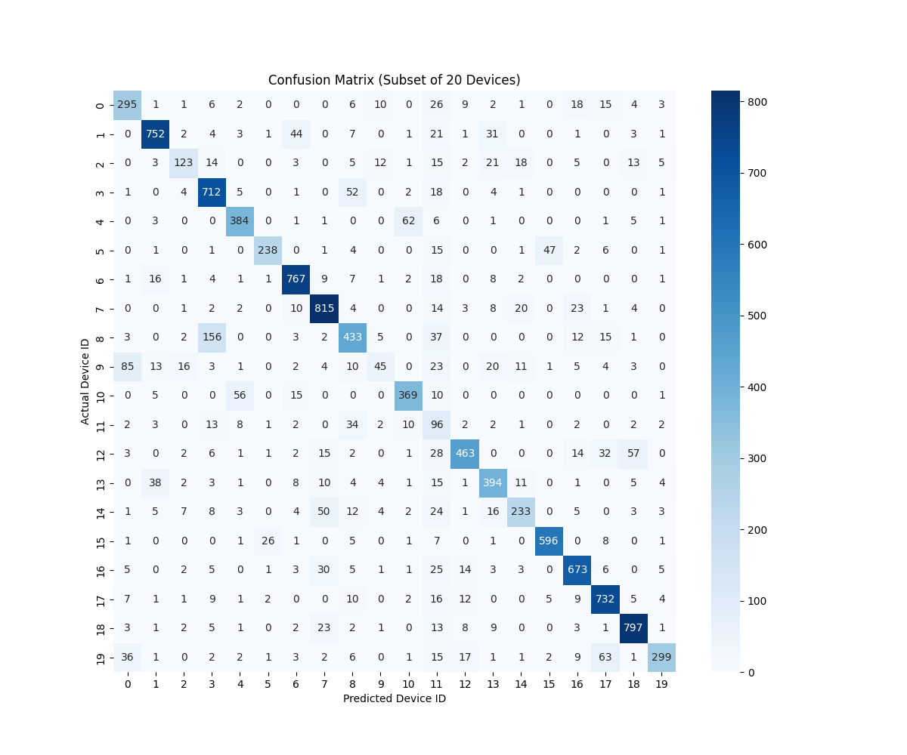

# RF Fingerprinting 
This project implements a **Physical Layer Security** framework to authenticate wireless IoT devices using **Radio Frequency (RF) Fingerprinting**. 
Unlike traditional security methods (like MAC addresses) which can be easily spoofed, this system identifies devices based on unique hardware imperfections inherent in their RF circuitry (e.g., I/Q imbalance, frequency offsets). Using **Digital Signal Processing (DSP)** and a **1D Convolutional Neural Network (CNN)**, the system successfully classifies **150 distinct WiFi transmitters** from the **WiSig ManyTx** dataset.

## Research Paper
This repository implements the DSP pipeline and neural network architecture described in our research on RF Fingerprinting.

[View Full Paper](rf_fingerprinting.pdf)

## Features
- **Scalable Identification:** Capable of classifying **150 unique devices**.
- **Robust DSP Pipeline:** Implements I/Q decomposition, Min-Max Normalization, and Gradient Clipping to handle raw hardware signals.
- **Deep Learning Architecture:** Uses a custom 1D-CNN optimized for time-series signal classification.
- **High Performance:** Achieves **36.63% Accuracy** on a 150-class problem (approx. **55x better than random guessing**).

## Dataset
This project uses the **WiSig (WiFi Signal) Dataset - ManyTx Subset**
- **Source:** [CORES Lab, UCLA](https://cores.ee.ucla.edu/downloads/datasets/wisig/).
- **Content:** Real-world WiFi preambles captured via USRP N210 radios.
- **Classes:** 150 off-the-shelf WiFi transmitters.
- **Signal Shape:** 256 complex-valued samples ($I + jQ$).

## Results
The system was evaluated on a held-out test set (20% of data).

| Metric | Score | Interpretation |
| :--- | :--- | :--- |
| **Accuracy** | **36.63%** | ~55x superior to random chance (0.66%). |
| **Precision** | **0.38** | High reliability in positive identifications. |
| **Recall** | **0.36** | Consistent detection of authorized devices. |
| **F1-Score** | **0.35** | Balanced performance across all 150 classes. |

### Confusion Matrix (Subset of 20 Devices)
The diagonal structure confirms distinct fingerprints are being detected, while off-diagonal clusters reveal manufacturing similarities between specific hardware batches.



## Prerequisites
The project requires the following python libraries:
```
numpy
tensorflow
scikit-learn
matplotlib
seaborn

## Acknowledgements
The authors would like to acknowledge the use of Large Language Models (Google Gemini) for assistance in debugging the Python scripts, optimizing memory usage, the training pipeline, refining the code structure, and for helping the authors understand the discussed topic at an accelerated rate.
